# Orion Control Room — Technical Whitepaper

## 1. Executive Summary
Orion Control Room es una arquitectura **observable, reproducible y explicable** para coordinar múltiples aplicaciones analíticas,
de decisión y reporting mediante **snapshots JSON** interoperables. El objetivo es separar **ejecución**, **observabilidad**
y **gobernanza**, permitiendo escalar desde demos locales hasta pipelines enterprise.

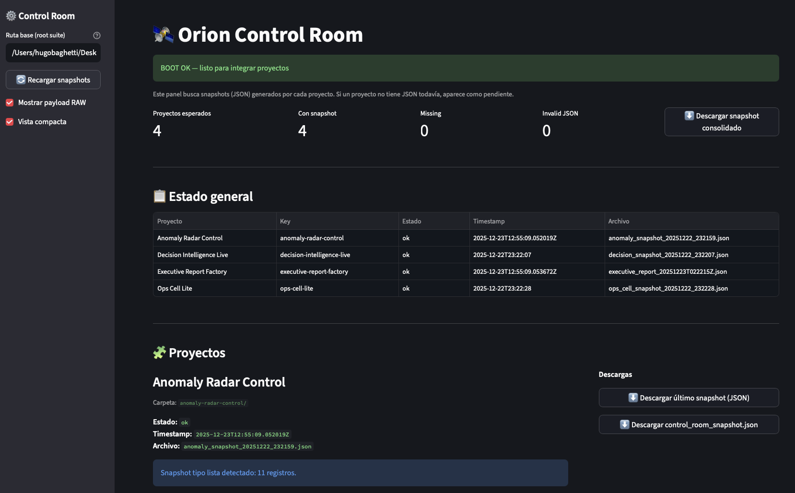

---

## 2. Problema que resuelve
Las organizaciones suelen tener:
- Dashboards aislados
- Pipelines frágiles
- Decisiones no auditables
- Reportes no reproducibles

Orion introduce un **contrato común (snapshot)** que permite:
- Auditoría
- Integración
- Observabilidad cruzada
- Human-in-the-loop (HITL)

---

## 3. Componentes de la Suite

### 3.1 Orion Control Room
Panel central que descubre snapshots en disco, valida estructura, consolida estado y permite descarga.

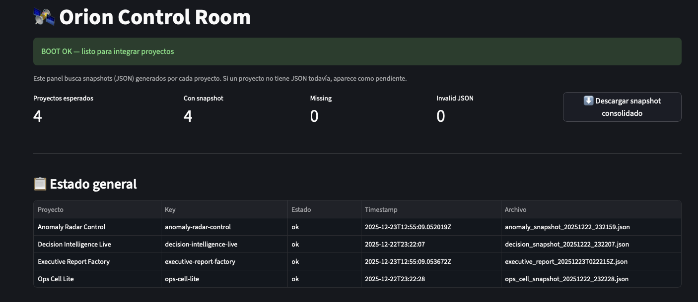
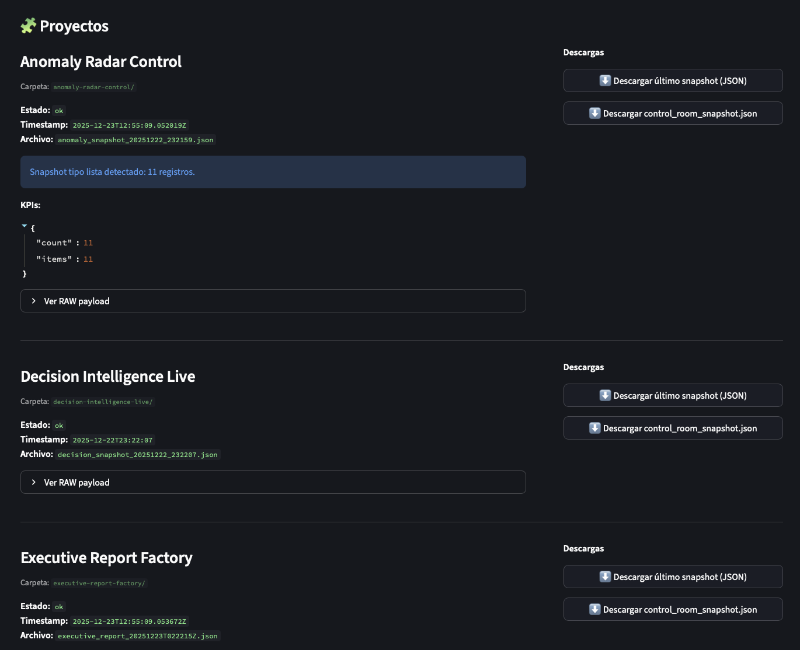

### 3.2 Anomaly Radar Control
Detección explicable de anomalías operacionales (latencia, errores, volumen).

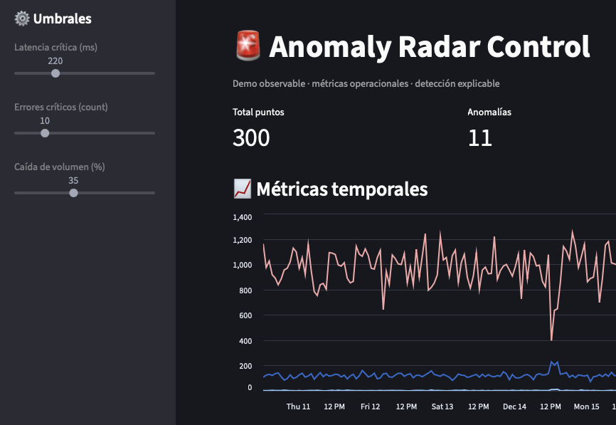
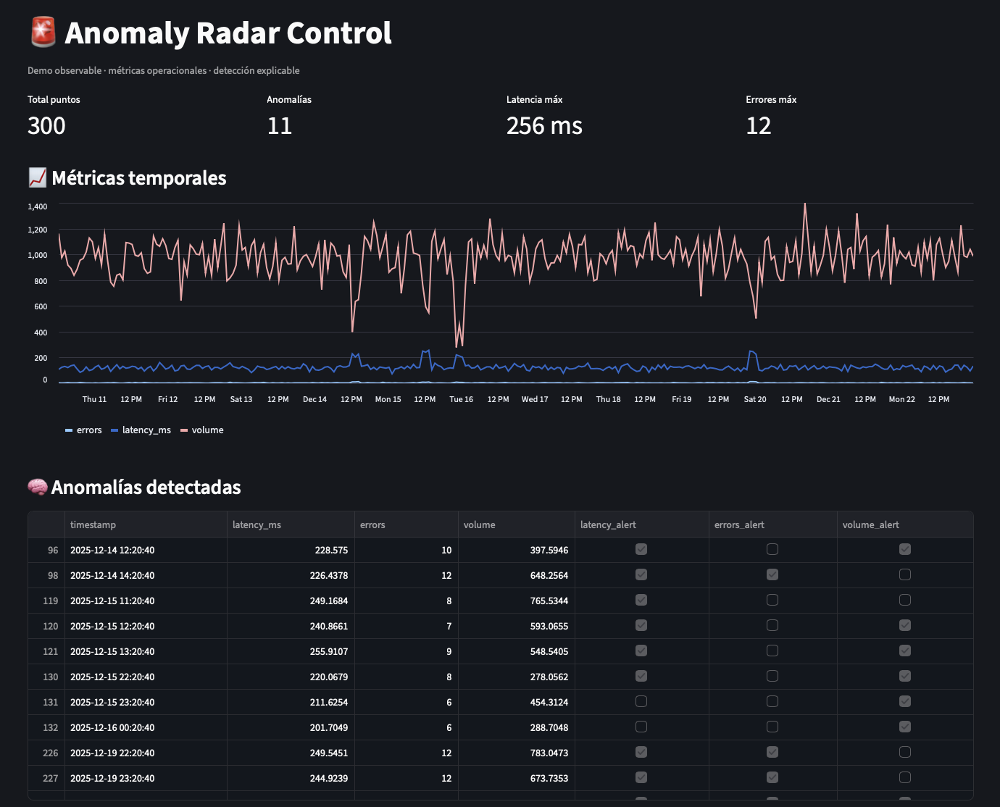

Salida:
- anomaly_snapshot_*.json

### 3.3 Decision Intelligence Live
Priorización de acciones bajo presupuesto con lógica contrafactual.

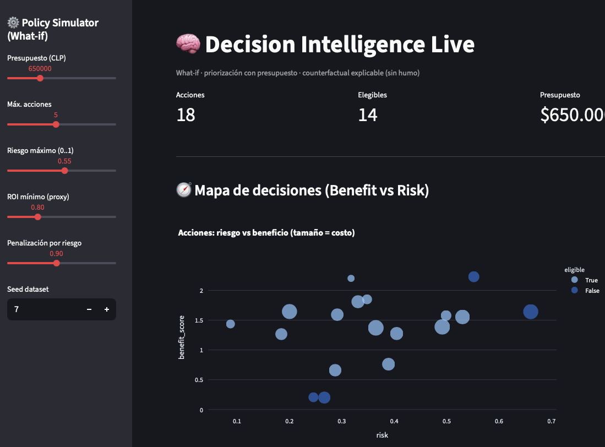
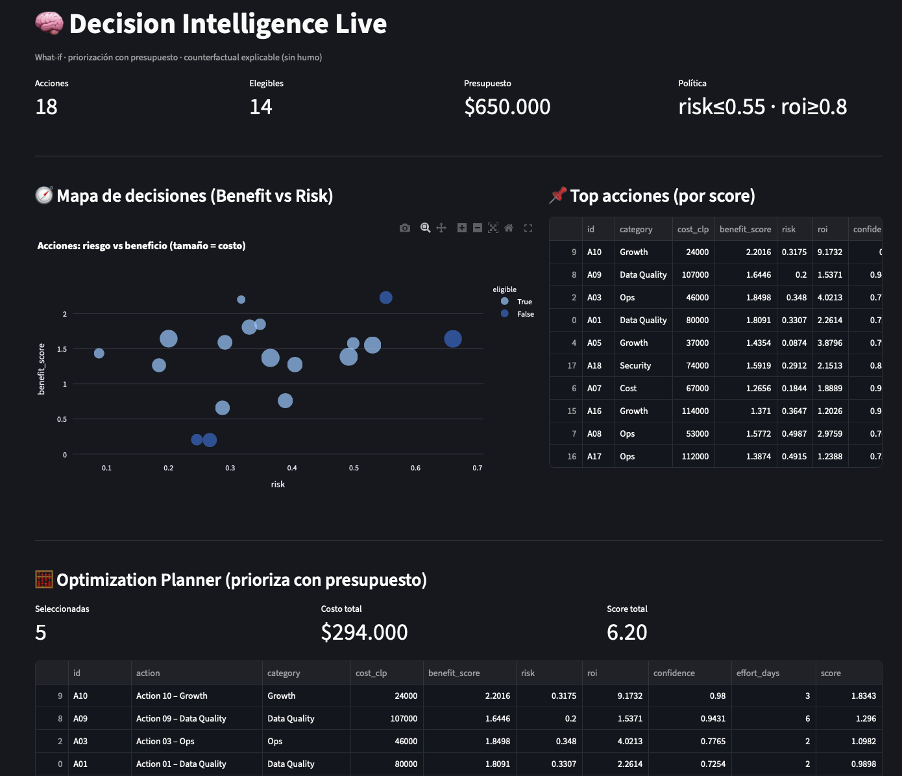

Salida:
- decision_snapshot_*.json

### 3.4 Executive Report Factory
Generación de reportes ejecutivos reproducibles (Markdown + JSON) con datos reales.

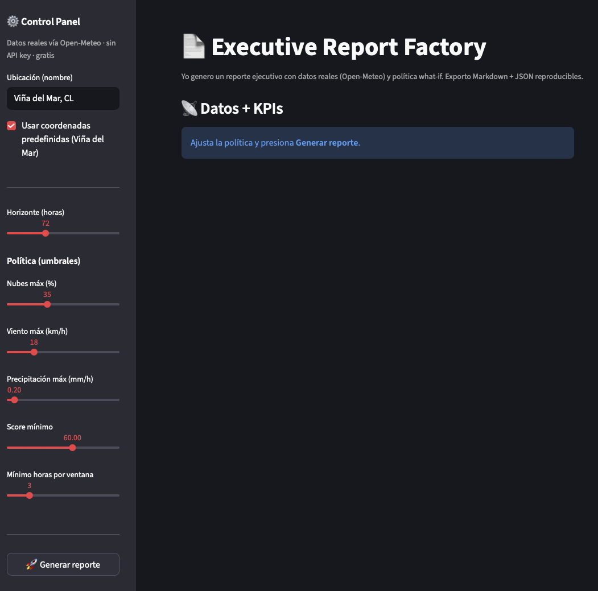
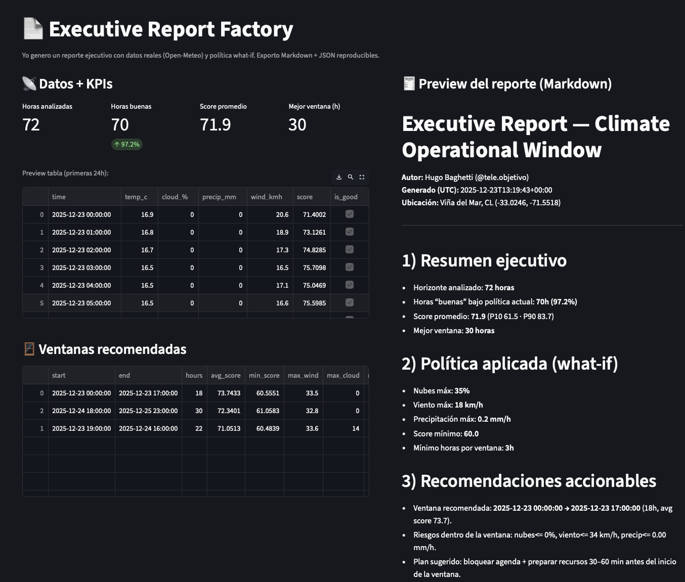

Salida:
- executive_report_*.md
- executive_report_*.json

### 3.5 Ops Cell Lite
Multi-agente operacional con HITL, runbooks y recomendaciones.

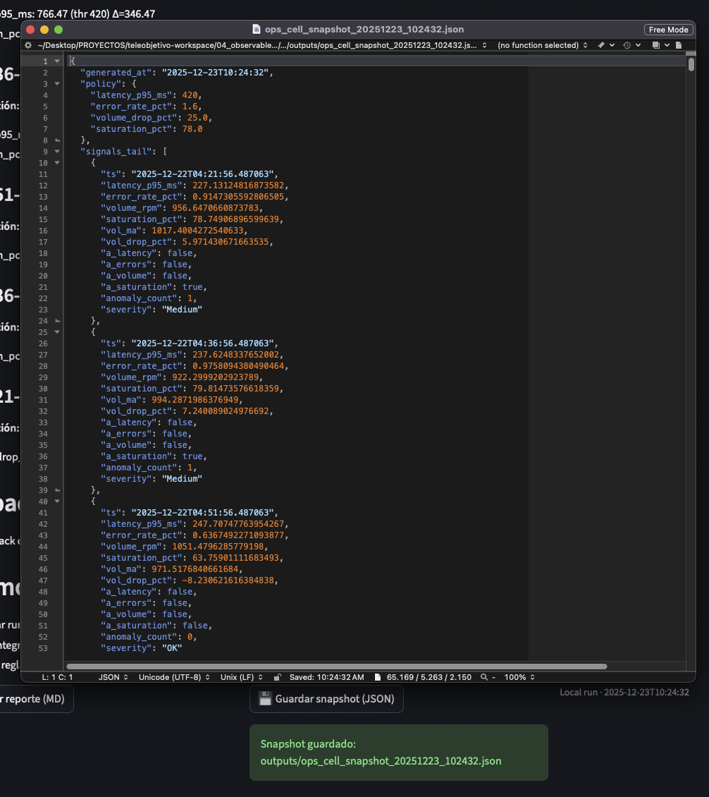
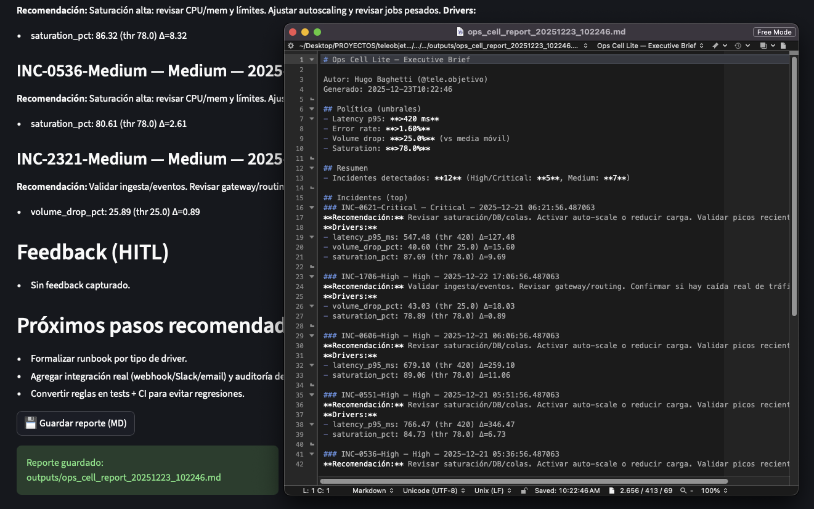

---

## 4. Arquitectura basada en Snapshots

Principio clave:
> Todo artefacto importante debe poder serializarse, versionarse y reproducirse.

Snapshots contienen:
- metadata
- KPIs
- política aplicada
- resultados
- timestamp

---

## 5. Casos de Uso

### Oficina / Operaciones
- Detección de incidentes
- Recomendaciones automáticas
- Reporte diario

### Investigación / Ciencia de Datos
- Experimentos reproducibles
- What-if auditable
- Comparación de políticas

### Banca / Retail (Pipeline BI)
- Anomalías en transacciones
- Priorización de iniciativas
- Reportes ejecutivos automatizados

---

## 6. Beneficios Clave
- Observabilidad real
- Explainability
- Escalabilidad
- Gobierno del dato
- Integración por contrato

---

## 7. Roadmap
- Webhooks (Slack/Email)
- Storage cloud (S3/GCS)
- CI de políticas
- Multi-tenant

---

## 8. Conclusión
Orion Control Room no es un dashboard: es un **sistema operativo para decisiones basadas en datos**.
